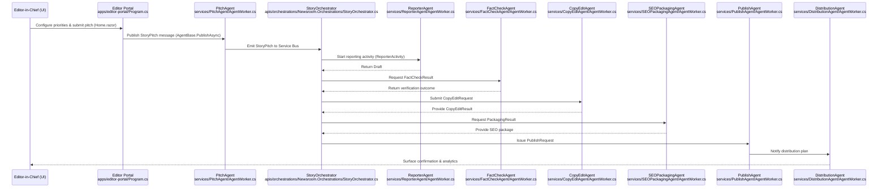

# DigiCinemAI Newsroom Platform

DigiCinemAI is a monorepo for an autonomous newsroom on Azure. It combines a Blazor-based editor portal, a fleet of .NET 8 agent microservices with Dapr patterns, and Durable Functions orchestrations.

## Getting Started

1. Install .NET 8 SDK and Docker.
2. Copy `.env.sample` to `.env` and populate secrets.
3. Restore and build all projects:
   ```bash
   dotnet restore DigiCinemAI.sln
   dotnet build DigiCinemAI.sln
   ```
4. Start local dependencies and core services:
   ```bash
   docker compose up --build
   ```
   The editor portal is available at http://localhost:5000.

### Local debugging profiles

Project-specific `launchSettings.json` files are intentionally excluded from the
repository to avoid committing machine-specific debug profiles. Developers can
generate local launch settings with `dotnet new` or configure profiles directly
inside their IDEs as needed.

## Repository Layout

- `docs/newsroom_spec.md` – newsroom operating model used for agent prompts.
- `libs/` – shared contracts, agent base classes, CMS abstractions.
- `services/` – containerized agents (Pitch, Assignment, Reporter, etc.).
- `apps/editor-portal` – Blazor Server control center for editors.
- `apis/orchestrations` – Durable Functions orchestrating story lifecycles.
- `infra/main.bicep` – Azure resource provisioning template.
- `.github/workflows/` – CI/CD pipelines for build and deployments.

## Running Tests

```bash
dotnet test DigiCinemAI.sln
```

## Deployment

1. Provision Azure infrastructure:
   ```bash
   az deployment group create \
     --resource-group <rg> \
     --template-file infra/main.bicep
   ```
2. Publish container images to Azure Container Registry and deploy with the GitHub Actions workflows (`Deploy Infra`, `Deploy Apps`).

## Operations

- Service Bus topics: `pitches`, `assignments`, `drafts`, `factcheck`, `copyedit`, `package`, `publish`, `distribute`, `analytics`, `moderation`, `errors`.
- Durable Functions orchestrate each story using the `StoryOrchestrator` state machine.
- Agents propagate telemetry to Application Insights with correlation IDs.

Refer to `docs/runbooks` (to be expanded) for production procedures.

## Story Flow Sequence

The diagram below outlines the automated journey from the Editor-in-Chief's input to the publication and distribution of a news item. Each lifeline is annotated with the file that defines the relevant object, function, or configuration.



### Key Implementations

- `StoryPitch`, `Draft`, `FactCheckResult`, and related records live in `libs/Newsroom.Contracts/Contracts.cs`.
- The Durable Functions orchestration is implemented in `apis/orchestrations/Newsroom.Orchestrations/StoryOrchestrator.cs`.
- Agent infrastructure helpers reside in `libs/Newsroom.Agents/AgentBase.cs`.
- Configuration templates for services are under each `services/<AgentName>/appsettings.json`.
